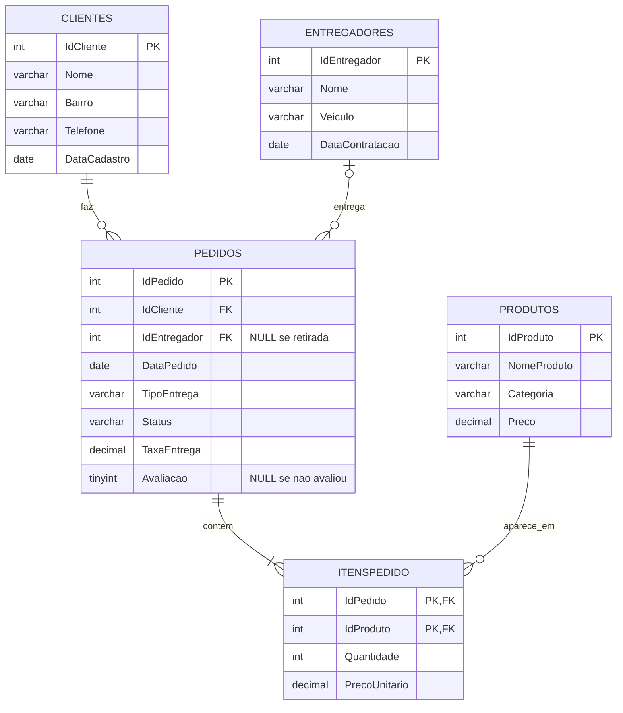

   

```mermaid
erDiagram
    CLIENTES ||--o{ PEDIDOS : faz
    ENTREGADORES o|--o{ PEDIDOS : entrega
    PEDIDOS ||--|{ ITENSPEDIDO : contem
    PRODUTOS ||--o{ ITENSPEDIDO : aparece_em

    CLIENTES {
        int IdCliente PK
        varchar Nome
        varchar Bairro
        varchar Telefone
        date DataCadastro
    }

    ENTREGADORES {
        int IdEntregador PK
        varchar Nome
        varchar Veiculo
        date DataContratacao
    }

    PEDIDOS {
        int IdPedido PK
        int IdCliente FK
        int IdEntregador FK "NULL se retirada"
        date DataPedido
        varchar TipoEntrega
        varchar Status
        decimal TaxaEntrega
        tinyint Avaliacao "NULL se nao avaliou"
    }

    PRODUTOS {
        int IdProduto PK
        varchar NomeProduto
        varchar Categoria
        decimal Preco
    }

    ITENSPEDIDO {
        int IdPedido PK, FK
        int IdProduto PK, FK
        int Quantidade
        decimal PrecoUnitario
    }
```

